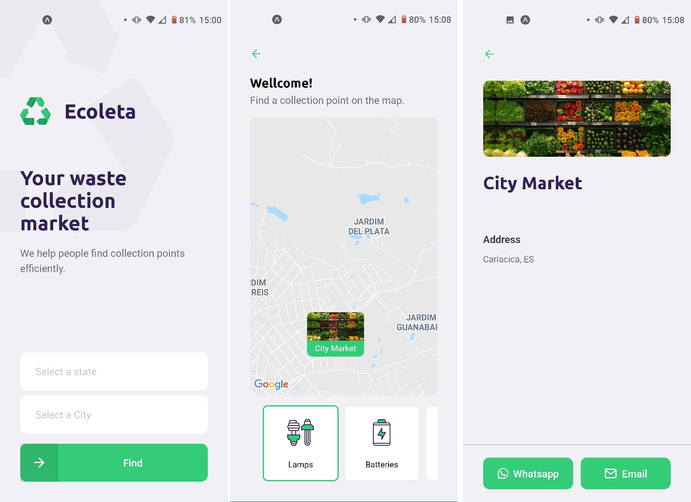

# Ecoleta Mobile app

React Native Expo app for finding collection points nearby.



# Getting started

Create `.env` file by copying `.env.example` and setting up required configurations.

Install dependencies.

```bash
npm install
```

Run react app.

```bash
expo start
```
